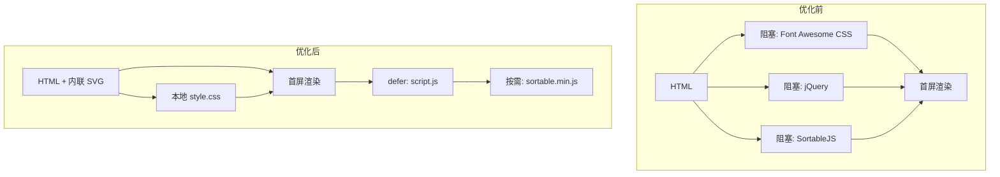

# 首页秒开与去外部依赖优化计划

## 现状分析

当前首页 ([app/templates/index.html](app/templates/index.html)) 在 `<head>` 中同步加载 3 个外部 CDN 资源，均会阻塞渲染/解析：

| 资源                  | 来源                   | 大小    | 影响        |
| ------------------- | -------------------- | ----- | --------- |
| Font Awesome 5.15.3 | cdnjs.cloudflare.com | ~75KB | 阻塞首屏渲染    |
| jQuery 3.6.0        | code.jquery.com      | ~90KB | 阻塞 DOM 解析 |
| SortableJS 1.15.2   | cdn.jsdelivr.net     | ~20KB | 阻塞 DOM 解析 |

外部网络延迟（DNS 解析、连接建立、跨国 CDN）会直接拖慢首屏，无法做到秒开。

---

## 优化策略

### 1. Font Awesome → 内联 SVG 图标

**目标**：完全移除 Font Awesome 依赖，用内联 SVG 替代。

**当前使用的图标**（来自 grep 与模板分析）：

- `fa-eye` / `fa-eye-slash`：切换角标按钮
- `fa-plus`：新增按钮
- `fas fa-link`：默认链接图标（新增项、搜索结果等）
- `fa-robot`、`fa-server`：用户配置中的分类图标（需兼容）

**实现**：

- 在 [app/static](app/static) 下新增 `icons/` 目录，存放 SVG 文件或一个 `icons.svg` 精灵图
- 新增 [app/utils.py](app/utils.py) 中的 `icon_to_svg(icon_class)` 辅助函数，将 `fas fa-eye` 等映射为对应 SVG 片段
- 模板中：`<i class="fas fa-eye">` 改为 `<svg class="icon-svg" aria-hidden="true">...</svg>`
- 用户配置的 `fas fa-robot` 等：在服务端渲染时通过 `icon_to_svg()` 输出 SVG；无法识别的 fallback 为 `fa-link` 的 SVG

**备选**：若希望保留 Font Awesome 类名兼容，可将完整 Font Awesome 字体与 CSS 下载到 `app/static/vendor/`，改为本地引用，但体积较大（~500KB+），不如内联 SVG 轻量。

---

### 2. jQuery → 原生 JavaScript

**目标**：移除 jQuery，用 `fetch`、`document.querySelector`、`addEventListener` 等原生 API 重写 [app/static/js/script.js](app/static/js/script.js)。

**主要替换点**：

| jQuery 用法                        | 原生替代                                                   |
| -------------------------------- | ------------------------------------------------------ |
| `$.ajax()`                       | `fetch()`                                              |
| `$(selector)`                    | `document.querySelector()` / `querySelectorAll()`      |
| `$(document).ready(fn)`          | `DOMContentLoaded` 或 `defer`                           |
| `.on('click', fn)`               | `element.addEventListener('click', fn)`                |
| `.addClass()` / `.removeClass()` | `classList.add/remove/toggle`                          |
| `.attr()` / `.data()`            | `getAttribute` / `dataset`                             |
| `.append()` / `.empty()`         | `appendChild` / `innerHTML = ''`                       |
| `.show()` / `.hide()`            | `style.display`                                        |
| `.val()`                         | `value`                                                |
| `.find()` / `.closest()`         | `querySelector` / `closest()`                          |
| 事件委托                             | `document.addEventListener` + `event.target.closest()` |

**注意**：`index.html` 内联脚本中有 `$('#edit-modal').is(':visible')` 等，需一并改为原生实现。

---

### 3. SortableJS → 本地化 + 延迟加载

**目标**：消除对 jsdelivr CDN 的依赖，并延迟加载以不阻塞首屏。

**实现**：

- 将 SortableJS 源码下载到 `app/static/js/sortable.min.js`（或通过 npm 下载后复制到 static）
- 在 `script.js` 中，仅在用户可能拖拽时再加载：例如在 `DOMContentLoaded` 后使用 `import()` 动态加载，或通过 `document.createElement('script')` 插入
- 更优：将 Sortable 初始化放到 `requestIdleCallback` 或 `setTimeout(..., 0)` 中，确保首屏渲染完成后再执行

**备选**：若项目允许引入简单构建流程，可将 SortableJS 与主脚本打包，但当前为纯 Flask 静态资源，直接本地化更合适。

---

### 4. 加载顺序与关键路径优化

**当前**：

```html
<head>
  <link href="https://cdnjs.../font-awesome...">  <!-- 阻塞 -->
  <link href="/static/css/style.css">
  <script src="https://code.jquery.com/..."></script>  <!-- 阻塞 -->
  <script src="https://cdn.jsdelivr.net/.../Sortable.min.js"></script>
</head>
<body>
  ...
  <script src="/static/js/script.js"></script>
</body>
```

**优化后**：

```html
<head>
  <link rel="stylesheet" href="{{ url_for('static', filename='css/style.css') }}">
  <!-- 无外部 CSS，style.css 同源快速加载 -->
</head>
<body>
  <!-- 首屏 HTML 内容，图标已为内联 SVG，无需字体 -->
  ...
  <script src="{{ url_for('static', filename='js/script.js') }}" defer></script>
  <!-- SortableJS 在 script.js 内按需动态加载 -->
</body>
```

- 首屏仅依赖：HTML（SSR）+ 本地 CSS，无外部请求
- 主脚本 `defer` 加载，不阻塞解析
- SortableJS 延迟加载，首屏不依赖

---

## 文件变更清单

| 文件                                                             | 变更                                                                          |
| -------------------------------------------------------------- | --------------------------------------------------------------------------- |
| [app/templates/index.html](app/templates/index.html)           | 移除 Font Awesome/jQuery/Sortable 的 CDN 引用；图标改为内联 SVG 或服务端输出的 SVG；内联脚本改为原生 JS |
| [app/static/js/script.js](app/static/js/script.js)             | 重写为原生 JS；SortableJS 改为动态加载本地文件                                              |
| [app/static/icons/](app/static/icons/)                         | 新增：eye.svg、eye-slash.svg、plus.svg、link.svg、robot.svg、server.svg 等           |
| [app/utils.py](app/utils.py)                                   | 新增 `icon_to_svg(icon_class)`，供模板渲染图标                                        |
| [app/static/js/sortable.min.js](app/static/js/sortable.min.js) | 新增：SortableJS 本地副本                                                          |
| [app/routes.py](app/routes.py)                                 | 搜索接口等返回的 `icon` 若为 Font Awesome 类名，需在服务端或前端统一转为 SVG（视实现方式）                  |
| [app/templates/config.html](app/templates/config.html)         | 若使用 Font Awesome，需同步替换（当前未见 CDN 引用，可能无需改）                                   |

---

## 数据流示意



---

## 预期效果

- **首屏**：仅需 HTML + 本地 CSS，无外部请求，可做到秒开
- **交互**：主脚本 defer 加载，Sortable 按需加载，不影响首屏
- **离线/弱网**：所有资源同源，不依赖外网 CDN

---

## 实施顺序建议

1. 准备 SVG 图标与 `icon_to_svg` 工具函数
2. 模板中将 Font Awesome 替换为内联 SVG
3. 将 SortableJS 下载到本地并改为动态加载
4. 将 script.js 从 jQuery 重写为原生 JS
5. 移除所有 CDN 引用，调整加载顺序
6. 在 config 页与搜索等接口中统一图标输出逻辑（若需要）
